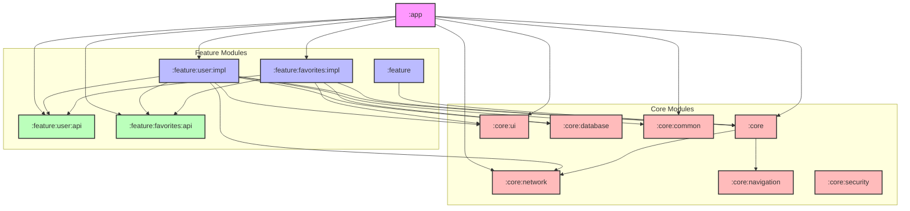

GitHubUsers App
======================

This is the repository for the **GitHubUsers** app. It is a **work in progress** 🚧.

**GitHubUsers** is a fully functional Android app built entirely with Kotlin and Jetpack Compose. It follows modern Android design and development best practices and is intended to be a useful reference for developers. The primary goal of this project is to learn new technologies and apply them effectively in scalable production environments.

# Features

**GitHubUsers** interacts with the GitHub API to display content. Users can browse for GitHub users, view their detailed profiles, and mark profiles as favorites to easily access them offline or at a later time.

# Development Environment

**GitHubUsers** uses the Gradle build system and can be imported directly into Android Studio (make sure you are using the latest stable version available [here](https://developer.android.com/studio)).

The app uses product flavors to support different environments:
*   `dev` - Development environment
*   `stg` - Staging environment
*   `prd` - Production environment

To build and run the app, select the `app` run configuration and choose an appropriate build variant (for example, `devDebug`).

# Architecture

The **GitHubUsers** app follows the [official architecture guidance](https://developer.android.com/topic/architecture) provided by Google.

The architecture is built on a unidirectional data flow (UDF) and consists of the following layers:
- **UI Layer:** Displays application data and handles user interactions using Jetpack Compose and ViewModel state holders.
- **Domain/Feature Layer:** Connects the UI to the Data Layer, containing feature-specific business logic.
- **Data Layer:** Manages application data, backed by a single source of truth. It uses Room for local database caching and Retrofit for remote network requests.

The app relies heavily on:
- **Jetpack Compose** for building declarative UI and Navigation.
- **Kotlin Coroutines & Flow** for asynchronous programming and reactive state streams.
- **Hilt** for robust dependency injection.

# Modularization

This project is modularized by features and layers, following modern Android development practices to improve build times, enforce separation of concerns, and enable code reuse.

# License

**GitHubUsers** is distributed under the terms of the Apache License (Version 2.0).
