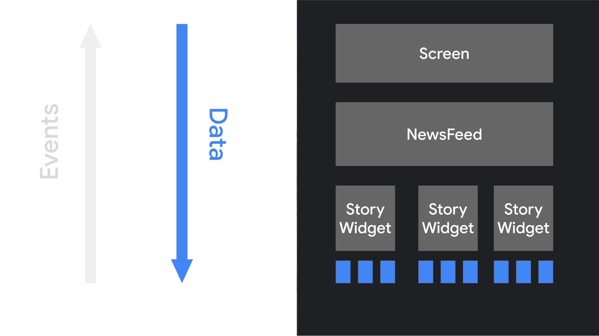
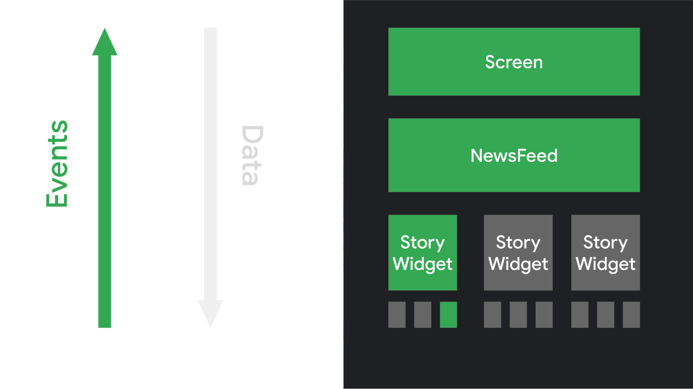

## Thinking in Compose

Jetpack compose is the modern toolkit for building Android UI, simplifying the development of apps that adapt to any display size. Compose simplifies writings and maintaining your app by providing a **declarative** API that lets you render your app UI without **imperatively** mutating frontend views

## The declarative programming paradigm

   Historically, an Android view hierarchy has been representable as a tree of UI widgets. 
As the state of the app changes because of things like user interactions, the UI hierarchy needs to be updated to display the current data. 
The most common way of updating the UI is to walk the tree using functions like findViewById(), 
and change nodes by calling methods like button.setText(String), container.addChild(View), or img.setImageBitmap(Bitmap). 
These methods change the internal state of the widget.

Over the last several years, the entire industry has started shifting to a declarative UI model. 
This model simplifies the engineering associated with building and updating user interfaces. 
The technique works by conceptually regenerating the entire screen from scratch, then applying only the necessary changes. 
This approach avoids the complexity of manually updating a stateful view hierarchy. Compose is a declarative UI framework.

One challenge with regenerating the entire screen is that it is **potentially expensive**, in terms of time, computing power, and battery usage. 
To mitigate this cost, **Compose intelligently chooses which parts of the UI need to be redrawn at any given time**. 
This does have some implications for how you design your UI components

## The declarative paradigm shift

With many imperative object-oriented UI toolkits, you initialize the UI by instantiating a tree of widgets. You often do this by inflating an XML layout file. Each widget maintains its own internal state, and exposes getter and setter methods that let the app logic interact with the widget.

In Compose's declarative approach, widgets are relatively stateless and don't expose setter or getter functions. In fact, widgets are not exposed as objects. You update the UI by calling the same composable function with different arguments.

When the user interacts with the UI, the UI raises events such as onClick. Those events should notify the app logic, which can then change the app's state. When the state changes, the composable functions are called again with the new data. This causes the UI elements to be redrawn

